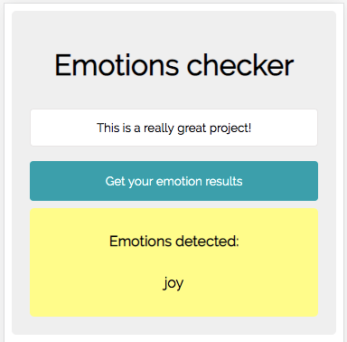
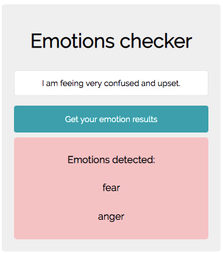

# emotion-checker

Here is a link to the live app for the simple web app I created to take user input text, and return the emotions detected from an emotion detection API.  The background color of the results changes based on a seperate API call to determine tone.

https://meredythp.github.io/emotion-checker/

## Screenshots

Start page Example:

Positive Example:

Negative Example:

No Emotion Example:

Waiting for API Response Example: 

## Built With
* JavaScript
* HTPS
* CSS
